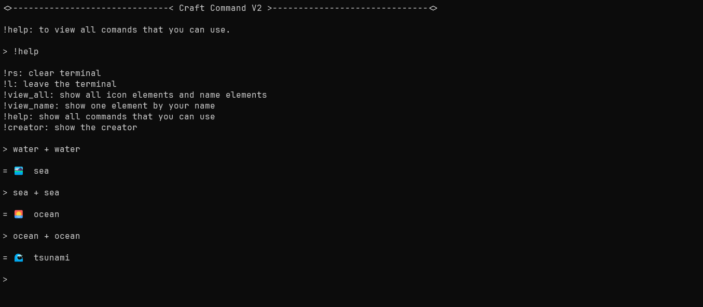

# Craft Command

**Craft Command** is a system like the Infinite Craft but in Terminal, Just it.



### System Commands


- use **!l** to close the terminal.
- use **!view_all** to show all icon elements that you getted.
- use **!view_name** to show the element by your name.
- use **!help** to show all commands that you can use.
- use **!creator** to show the creator.

### How to merge elements?
to merge, you must use a pattern.

Pattern: 
```
element_name + element_name
```

For example:

```
> water + water
```

and if the *element_1* and *element_2* exists, so, the merge will work.

```
> cloud + cloud

= Storm
```


I inspired in [InfinityCraft](https://neal.fun/infinite-craft/) to do it.
<<<<<<< HEAD


=======
>>>>>>> e479bb490bff367cb0043486d84776b4406c2b66
